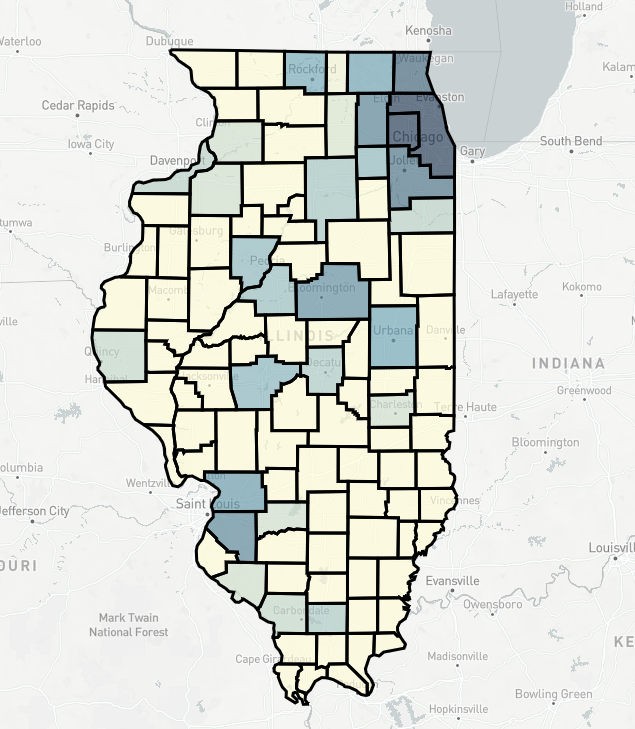

# FastGeosuitability

FastGeosuitability is a geosuitability api to help determine what areas are most suitable based off of a given set of variables. The api will rank each location with a set of weighted and final score to help you determine the best location. FastGeosuitability is written in [Python](https://www.python.org/) using the [FastAPI](https://fastapi.tiangolo.com/) web framework. 

Built with inspiration from [ArcGIS Business Analyst](https://doc.arcgis.com/en/business-analyst/web/suitability-analysis.htm).

---

**Source Code**: <a href="https://github.com/mkeller3/FastGeosuitability" target="_blank">https://github.com/mkeller3/FastGeosuitability</a>

---

## Requirements

FastGeosuitability requires PostGIS >= 2.4.0.

## Configuration

In order for the api to work you will need to edit the .env with your database connections.

```
DB_HOST=localhost
DB_DATABASE=data
DB_USERNAME=postgres
DB_PASSWORD=postgres
DB_PORT=5432
```

## Usage

### Running Locally

To run the app locally `uvicorn main:app --reload`

### Production
Build Dockerfile into a docker image to deploy to the cloud.

## API

| Method | URL                                                                              | Description                                             |
| ------ | -------------------------------------------------------------------------------- | ------------------------------------------------------- |
| `POST`  | `/api/v1/services/map_suitability/`                                             | [Map Suitability](#Map-Suitability)      |
| `POST`  | `/api/v1/services/point_suitability/`                                           | [Point Suitability](#Point-Suitability)  |
| `POST`  | `/api/v1/services/polygon_suitability/`                                         | [Polygon Suitability](#Polygon-Suitability)  |
| `GET`  | `/api/v1/health_check`                                                           | Server health check: returns `200 OK`    |


## Variables

In order to determine the sutiability of each location, you will need to pass in a list of variables. For each variable, we will need a couple
of details to help the api determine the suitability of the location.

### Variable Parameters
* `table=table` - name of the table.
* `column=table-col` - name of a column in your table to perform suitability analysis with.
* `type=type` - How to determine suitability score of variable. For more information
about types go to the [type descriptions](#type-descriptions) area.
* `influence=influence` - The type of influence to apply to the variable. Options `low, high, ideal`. For more information
about influence type go to the [influence descriptions](#influence-descriptions) area.
* `weight=weight` - how much weight to applt to the variable. All variables must total up to 100.

### Type Descriptions

#### Sum
Determine the sum all the values of the choosen column and table that intersect the sutiability area.
For polygons that do no intersect the entire sutiability area, the api performs a percentage based sum.
For example if the sum of the column for a polygon is 100, but only 80% of the polygon is
within the suitability area. The api will account for the 20% loss of area and set the sum to 80.


#### Avg
Determine the average of all the values of the choosen column and table that intersect the sutiability area.
For polygons that do no intersect the entire sutiability area, the api performs a percentage based average.
For example if the average of the column for a polygon is 100, but only 80% of the polygon is
within the suitability area. The api will account for the 20% loss of area and set the average to 80.


#### Count
Determine the number of features within a table that intersect the sutiability area.

### Influence Descriptions


## Results

## Map Suitability

The map suitability endpoints allows you to perform a suitability analyis on a set of geometries
already loaded into your database.

### Map Suitability Parameters
* `table=table` - name of the table.
* `table_column=table-col` - name of a unique column in your table.
* `table_values=[values]` - list of unique values from your table column.
* `variables=[{variables}]` - list of variables to perform site suitability against.
* `return_geometry=bool` - boolean to determine if geometry is returned.
* `filter=cql-expr` - filters features via a CQL expression.

### Map Suitability Example
In the example below, I am trying to rank all the counties in Illinois based off of 3 variables.
In this situation, I am trying to find the best county to live in if I wanted to be by a large
amount of Walmart's, Chick Fil A's, and Starbucks. My `table` parameter is counties with my `table_column`
set to `fips`, since each county has a unique fips code. I then listed all of the fips code in the `table_values`
parameter, but could also add a `filter` parameter of `state_name = 'Illinois'`. Next, I added in my list of variables
for Walmart's, Chick Fil A's, and Starbucks.

```json
"variables":[
      {
          "table": "walmart_locations",
          "column": "gid",
          "type": "count",
          "influence": "high",
          "weight": 25
      },
      {
          "table": "chick_fil_a_locations",
          "column": "gid",
          "type": "count",
          "influence": "high",
          "weight": 25
      },
      {
          "table": "starbucks",
          "column": "gid",
          "type": "count",
          "influence": "high",
          "weight": 50
      }
  ]
```

For each variable, you will need to define an object containing a certain list of keys and values.
For more information about defining variables, go to the [variables](#variables) section which goes into full detail.

### Map Suitability Results
Your results will be returned as a geojson collection. For each polygon, you will see a new set of properties returned.
For more information about results, go to the [results](#results) section which goes into full detail.

For this example, Cook County would be the best county for me to live in, if I wanted to be near
a large amount of Walmart's, Chick Fil A's, and Starbucks with a final score of 100.

### Map Suitability Example Input
```json
{
    "table": "counties",
    "table_column": "fips",
    "table_values": [
        "17077",
        "17043",
        "17115",
        "17097",
        "17099",
        "17111",
        "17113",
        "17001",
        "17007",
        "17019",
        "17029",
        "17031",
        ...
    ],
    "return_geometry": true,
    "variables":[
        {
            "table": "walmart_locations",
            "column": "gid",
            "type": "count",
            "influence": "high",
            "weight": 25
        },
        {
            "table": "chick_fil_a_locations",
            "column": "gid",
            "type": "count",
            "influence": "high",
            "weight": 25
        },
        {
            "table": "starbucks",
            "column": "gid",
            "type": "count",
            "influence": "high",
            "weight": 50
        }
    ]
}
```

### Map Suitability Example Response
```json
{
    "type": "FeatureCollection",
    "features": [
        {
            "type": "Feature",
            "geometry": null,
            "properties": {
                "fips": "17031",
                "walmart_locations_count_gid": 42,
                "chick_fil_a_locations_count_gid": 8,
                "starbucks_count_gid": 312,
                "weighted_score_walmart_locations_count_gid": 25.0,
                "score_walmart_locations_count_gid": 1.0,
                "weighted_score_chick_fil_a_locations_count_gid": 25.0,
                "score_chick_fil_a_locations_count_gid": 1.0,
                "weighted_score_starbucks_count_gid": 50.0,
                "score_starbucks_count_gid": 1.0,
                "final_score": 100.0
            }
        },
        {
            "type": "Feature",
            "geometry": null,
            "properties": {
                "fips": "17043",
                "walmart_locations_count_gid": 8,
                "chick_fil_a_locations_count_gid": 7,
                "starbucks_count_gid": 69,
                "weighted_score_walmart_locations_count_gid": 4.2682926829268295,
                "score_walmart_locations_count_gid": 0.17073170731707318,
                "weighted_score_chick_fil_a_locations_count_gid": 21.428571428571427,
                "score_chick_fil_a_locations_count_gid": 0.8571428571428571,
                "weighted_score_starbucks_count_gid": 10.932475884244374,
                "score_starbucks_count_gid": 0.21864951768488747,
                "final_score": 36.62933999574263
            }
        },
        {
            "type": "Feature",
            "geometry": null,
            "properties": {
                "fips": "17097",
                "walmart_locations_count_gid": 9,
                "chick_fil_a_locations_count_gid": 2,
                "starbucks_count_gid": 41,
                "weighted_score_walmart_locations_count_gid": 4.878048780487805,
                "score_walmart_locations_count_gid": 0.1951219512195122,
                "weighted_score_chick_fil_a_locations_count_gid": 3.571428571428571,
                "score_chick_fil_a_locations_count_gid": 0.14285714285714285,
                "weighted_score_starbucks_count_gid": 6.430868167202572,
                "score_starbucks_count_gid": 0.12861736334405144,
                "final_score": 14.880345519118947
            }
        }...
    ]
}
```

## Map Suitability Map


## Point Suitability

The point suitability endpoints allows you to perform a suitability analyis on a set of known latitude and longitudes.

### Point Suitability Parameters
* `points=[points]` - list of points to perform suitability analysis against.
* `buffer_in_kilometers=distance-in-kilometers` - distance in kilometers to search for data around each point.
* `variables=[{variables}]` - list of variables to perform site suitability against.
* `return_geometry=bool` - boolean to determine if geometry is returned.

### Point Suitability Example

In the example below, I am trying to rank a series of larger cities within the Midwest based off of 3 variables like the example before. In this situation, I am trying to find the best city to live in if I wanted to be by a large amount of Walmart's, Chick Fil A's, and Starbucks. Next, I added in my list of variables
for Walmart's, Chick Fil A's, and Starbucks.

```json
"variables":[
      {
          "table": "walmart_locations",
          "column": "gid",
          "type": "count",
          "influence": "high",
          "weight": 25
      },
      {
          "table": "chick_fil_a_locations",
          "column": "gid",
          "type": "count",
          "influence": "high",
          "weight": 25
      },
      {
          "table": "starbucks",
          "column": "gid",
          "type": "count",
          "influence": "high",
          "weight": 50
      }
  ]
```

For each variable, you will need to define an object containing a certain list of keys and values.
For more information about defining variables, go to the [variables](#variables) section which goes into full detail.

### Point Suitability Results

Your results will be returned as a geojson collection. For each polygon, you will see a new set of properties returned.
For more information about results, go to the [results](#results) section which goes into full detail.

For this example, Chicago would be the best city for me to live in, if I wanted to be near
a large amount of Walmart's, Chick Fil A's, and Starbucks with a final score of 92.

### Point Suitability Example Input
```json
{
    "points": [
        {
            "latitude": 40.45,
            "longitude": -88.95
        },
        {
            "latitude": 41.63212,
            "longitude": -87.85594
        }
    ],
    "buffer_in_kilometers": 50,
    "return_geometry": false,
    "variables":[
        {
            "table": "walmart_locations",
            "column": "gid",
            "type": "count",
            "influence": "high",
            "weight": 50
        },
        {
            "table": "chick_fil_a_locations",
            "column": "gid",
            "type": "count",
            "influence": "high",
            "weight": 50
        }
    ]
}
```

### Point Suitability Example Response
```json
{
    "type": "FeatureCollection",
    "features": [
        {
            "type": "Feature",
            "geometry": null,
            "properties": {
                "longitude": -87.85594,
                "latitude": 41.63212,
                "walmart_locations_count_gid": 42,
                "chick_fil_a_locations_count_gid": 12,
                "weighted_score_walmart_locations_count_gid": 50.0,
                "score_walmart_locations_count_gid": 1.0,
                "weighted_score_chick_fil_a_locations_count_gid": 50.0,
                "score_chick_fil_a_locations_count_gid": 1.0,
                "final_score": 100.0
            }
        },
        {
            "type": "Feature",
            "geometry": null,
            "properties": {
                "longitude": -88.95,
                "latitude": 40.45,
                "walmart_locations_count_gid": 3,
                "chick_fil_a_locations_count_gid": 2,
                "weighted_score_walmart_locations_count_gid": 0,
                "score_walmart_locations_count_gid": 0,
                "weighted_score_chick_fil_a_locations_count_gid": 0,
                "score_chick_fil_a_locations_count_gid": 0,
                "final_score": 0
            }
        }
    ]
}
```

## Point Suitability Map


## Polygon Suitability

The polygon suitability endpoints allows you to perform a suitability analyis on a set of known geojson polygons.

### Polygon Suitability Parameters
* `geojson_collection=geojson_collection` - a geojson collection of polygons.
* `variables=[{variables}]` - list of variables to perform site suitability against.
* `return_geometry=bool` - boolean to determine if geometry is returned.

### Polygon Suitability Example

In the example below, I am trying to rank a series of larger urban areas around Chicago based off of 3 variables like the example before. In this situation, I am trying to find the best suburb to live in if I wanted to be by a large amount of Walmart's, Chick Fil A's, and Starbucks. Next, I added in my list of variables
for Walmart's, Chick Fil A's, and Starbucks.

```json
"variables":[
      {
          "table": "walmart_locations",
          "column": "gid",
          "type": "count",
          "influence": "high",
          "weight": 25
      },
      {
          "table": "chick_fil_a_locations",
          "column": "gid",
          "type": "count",
          "influence": "high",
          "weight": 25
      },
      {
          "table": "starbucks",
          "column": "gid",
          "type": "count",
          "influence": "high",
          "weight": 50
      }
  ]
```

For each variable, you will need to define an object containing a certain list of keys and values.
For more information about defining variables, go to the [variables](#variables) section which goes into full detail.

### Polygon Suitability Results

Your results will be returned as a geojson collection. For each polygon, you will see a new set of properties returned.
For more information about results, go to the [results](#results) section which goes into full detail.

For this example, Lombard, IL would be the best city for me to live in, if I wanted to be near
a large amount of Walmart's, Chick Fil A's, and Starbucks with a final score of 87.5.

### Polygon Suitability Example Input
```json
{
    "geojson_collection": {
        "type": "FeatureCollection",
        "features": [
            {
                "type": "Feature",
                "properties": {},
                "geometry": {
                    "type": "Polygon",
                    "coordinates": [
                        [
                            [
                                -88.11447143554688,
                                41.91147545749747
                            ],
                            [
                                -88.10623168945312,
                                41.85421933478601
                            ],
                            [
                                -88.06777954101562,
                                41.80919639152055
                            ],
                            [
                                -87.94830322265625,
                                41.83682786072714
                            ],
                            [
                                -87.93045043945311,
                                41.89512180073503
                            ],
                            [
                                -88.01696777343749,
                                41.92578147109541
                            ],
                            [
                                -88.11447143554688,
                                41.91147545749747
                            ]
                        ]
                    ]
                }
            },
            {
                "type": "Feature",
                "properties": {},
                "geometry": {
                    "type": "Polygon",
                    "coordinates": [
                        [
                            [
                                -87.9345703125,
                                42.06560675405716
                            ],
                            [
                                -88.01422119140625,
                                42.06356771883277
                            ],
                            [
                                -87.92633056640625,
                                42.02787400232195
                            ],
                            [
                                -87.84530639648436,
                                42.01563154037739
                            ],
                            [
                                -87.82333374023438,
                                42.02991418347818
                            ],
                            [
                                -87.84393310546875,
                                42.07478160216737
                            ],
                            [
                                -87.9345703125,
                                42.06560675405716
                            ]
                        ]
                    ]
                }
            },...            
        ]
    },
    "return_geometry": false,
    "variables": [
        {
            "table": "walmart_locations",
            "column": "gid",
            "type": "count",
            "influence": "high",
            "weight": 50
        },
        {
            "table": "chick_fil_a_locations",
            "column": "gid",
            "type": "count",
            "influence": "high",
            "weight": 50
        }
    ]
}
```

### Polygon Suitability Example Response
```json
{
    "type": "FeatureCollection",
    "features": [
        {
            "type": "Feature",
            "geometry": null,
            "properties": {
                "index": 0,
                "walmart_locations_count_gid": 2,
                "chick_fil_a_locations_count_gid": 3,
                "starbucks_count_gid": 21,
                "weighted_score_walmart_locations_count_gid": 12.5,
                "score_walmart_locations_count_gid": 0.5,
                "weighted_score_chick_fil_a_locations_count_gid": 25.0,
                "score_chick_fil_a_locations_count_gid": 1.0,
                "weighted_score_starbucks_count_gid": 50.0,
                "score_starbucks_count_gid": 1.0,
                "final_score": 87.5
            }
        },
        {
            "type": "Feature",
            "geometry": null,
            "properties": {
                "index": 2,
                "walmart_locations_count_gid": 3,
                "chick_fil_a_locations_count_gid": 1,
                "starbucks_count_gid": 18,
                "weighted_score_walmart_locations_count_gid": 25.0,
                "score_walmart_locations_count_gid": 1.0,
                "weighted_score_chick_fil_a_locations_count_gid": 8.333333333333332,
                "score_chick_fil_a_locations_count_gid": 0.3333333333333333,
                "weighted_score_starbucks_count_gid": 42.10526315789473,
                "score_starbucks_count_gid": 0.8421052631578947,
                "final_score": 75.43859649122805
            }
        },
        {
            "type": "Feature",
            "geometry": null,
            "properties": {
                "index": 4,
                "walmart_locations_count_gid": 2,
                "chick_fil_a_locations_count_gid": 0,
                "starbucks_count_gid": 2,
                "weighted_score_walmart_locations_count_gid": 12.5,
                "score_walmart_locations_count_gid": 0.5,
                "weighted_score_chick_fil_a_locations_count_gid": 0,
                "score_chick_fil_a_locations_count_gid": 0,
                "weighted_score_starbucks_count_gid": 0,
                "score_starbucks_count_gid": 0,
                "final_score": 12.5
            }
        },
        {
            "type": "Feature",
            "geometry": null,
            "properties": {
                "index": 1,
                "walmart_locations_count_gid": 1,
                "chick_fil_a_locations_count_gid": 0,
                "starbucks_count_gid": 4,
                "weighted_score_walmart_locations_count_gid": 0,
                "score_walmart_locations_count_gid": 0,
                "weighted_score_chick_fil_a_locations_count_gid": 0,
                "score_chick_fil_a_locations_count_gid": 0,
                "weighted_score_starbucks_count_gid": 5.263157894736842,
                "score_starbucks_count_gid": 0.10526315789473684,
                "final_score": 5.263157894736842
            }
        },
        {
            "type": "Feature",
            "geometry": null,
            "properties": {
                "index": 3,
                "walmart_locations_count_gid": 1,
                "chick_fil_a_locations_count_gid": 0,
                "starbucks_count_gid": 2,
                "weighted_score_walmart_locations_count_gid": 0,
                "score_walmart_locations_count_gid": 0,
                "weighted_score_chick_fil_a_locations_count_gid": 0,
                "score_chick_fil_a_locations_count_gid": 0,
                "weighted_score_starbucks_count_gid": 0,
                "score_starbucks_count_gid": 0,
                "final_score": 0
            }
        }
    ]
}
```

## Polygon Suitability Map
